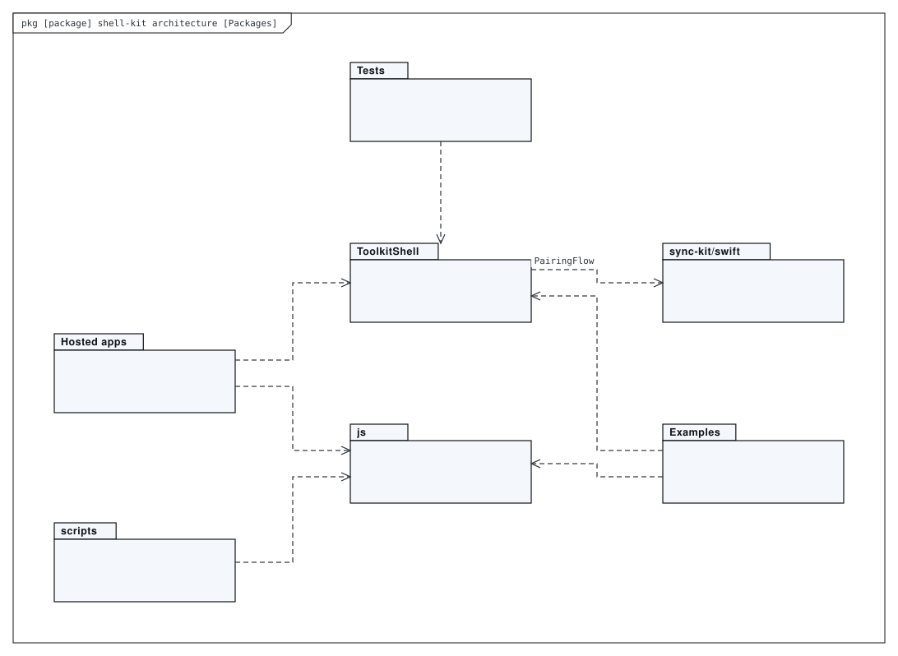
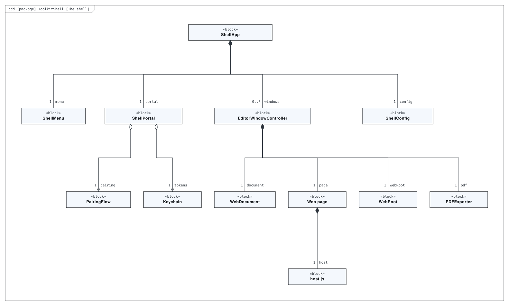
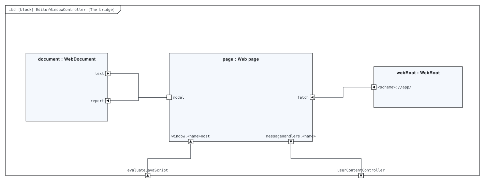
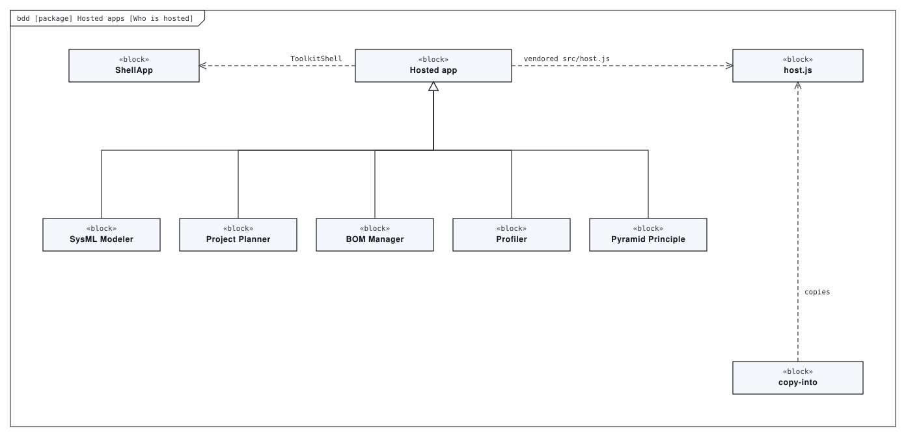
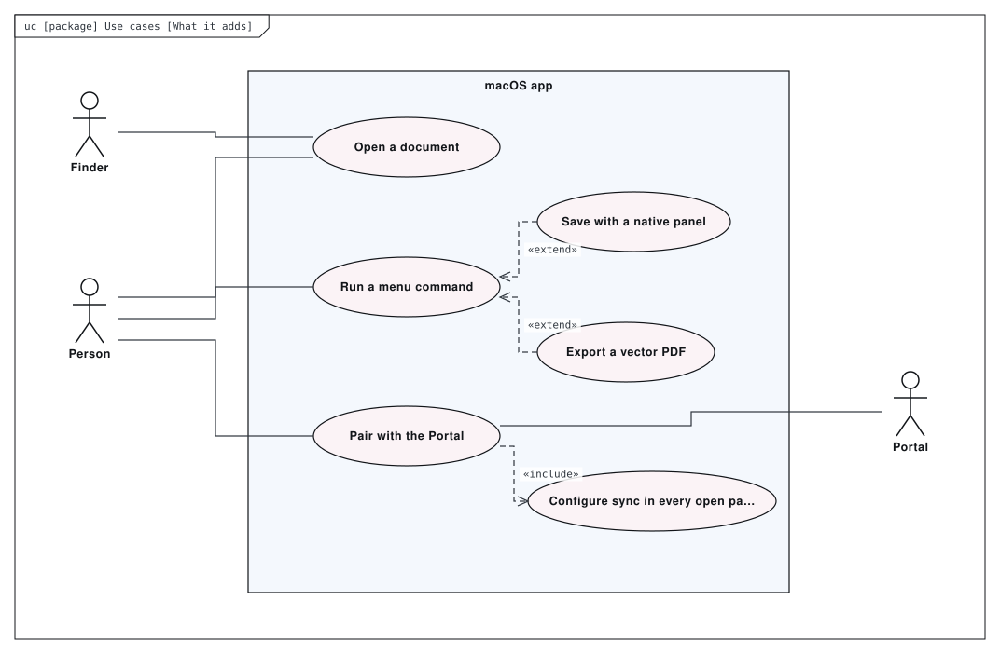

# Architecture

The macOS shell shared by the toolkit’s web apps. An app keeps its model and every editing rule in its web code; `ToolkitShell` hosts that page in a `WKWebView` and adds what a browser tab cannot — document windows, a real menu bar, Finder file opening, native save panels, vector PDF export, and pairing with the Portal. `js/host.js` is the page’s half of the bridge.

This directory holds a SysML model of the repository, made with [SysML Modeler](https://github.com/allenxhsu/sysml-modeler).
`architecture.sysml.json` is the source: open it with **File ▸ Open** in the modeler to edit it, and re-export the SVGs from there.
The SVGs below are exports of it. The model passes the modeler's checks with 0 errors and 0 warnings.

## Packages

*Package diagram* of **shell-kit architecture**.

## The shell

*Block definition diagram* of **ToolkitShell**. Sources/ToolkitShell/ — the SwiftPM library (macOS 14, Swift 6 toolchain).

## The bridge

*Internal block diagram* of **EditorWindowController**. The window, the WKWebView, and the message channel between them.

## Who is hosted

*Block definition diagram* of **Hosted apps**. The web apps that run inside the shell.

## What it adds

*Use case diagram* of **Use cases**. What the shell adds that a browser tab cannot.

